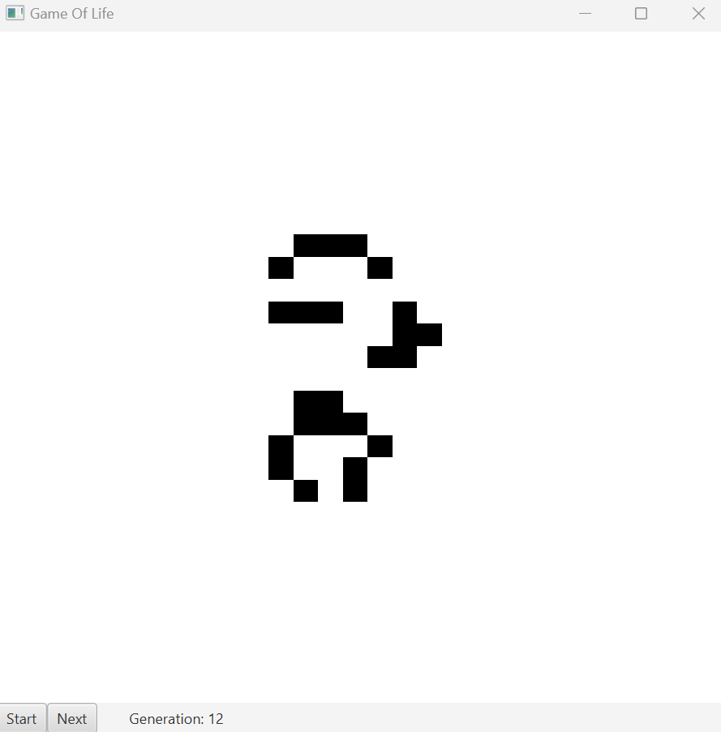

<div align="center">
  <p>Balint Taschner | Kacper Urbaniec | PPR | 06.04.2023</p>
  <br>
  </a>
  <br>
  <h1><ins>Game of Life</ins></h1>
</div>


## 📚 Report

Final Report on approach, implementation details, failed attempts & benchmarks can be found under [`REPORT.md`](REPORT.md).

> The interim presentation presented on 30.03.2023 can be found [here](https://docs.google.com/presentation/d/1Dz9J-74cFxwajnAQ61yJIGTDnNab2eYyysM42fTp0qE/edit?usp=sharing).

## 🛠️ Build

> For development, the application was compiled with the `MinGW w64 9.0` toolchain & run on Windows 11.

```bash
mkdir cmake-build-release
cmake -DCMAKE_BUILD_TYPE=Release -B cmake-build-release/ .
# game-of-life
cmake --build cmake-build-release/ --target game_of_life -- -j 9
# test cases
cmake --build cmake-build-release/ --target test -- -j 9
```

## 🔍 Tests 

Unit tests were written to verify the correctness of the parallel implementation.

```bash
cd cmake-build-release/test
.\test.exe
```

## 🚀 Run

The *Game of Life* implementation consists of a server/backend written in C++ and a sample client written in Java. The server and client communicate via sockets through a JSON API, which is described below. For benchmarking purposes, the server also has a stand-alone benchmark mode that does not require a client and outputs the results directly to the terminal.

### Server Mode

Launch server

```bash
cd cmake-build-release/
.\game_of_lifet.exe [server] [optional: port]
# .\game_of_life.exe "server" "1234"
```

Launch client

```bash
cd ui/
./gradlew run
```

> The client can be customised (switch interactive/benchmark mode, max generations, thread config, ...) through changing parameters found in `Main.java`.

#### API

Interactive Mode:

1. Client initiates

   ```json
	{
		"input": {
			// size of grid
			"size": int,
			// full grid, dead=false/alive=true
			"grid": [[bool]]	
		},
		// OPTIONAL
		"threadConfig": {
			"dynamic": bool,
			"threadCount": int
		}
	}
   ```

2. Server returns diff update

   ```json
	{
		"generation": int,
		// "Map", contains rows and indices which need to be flipped from last grid
		"diff": [int, [int]] 
	}
   ```

   > Example: Diff `[[2, [4, 5]], [5, [7]]]` means flip (alive/dead=>dead/alive) indices 4 & 5 at row 2 and flip index 7 at row 5. Rows & indices start at 0.

3. Client acknowledges

   ```json
	{
		// Continue to next generation?
		"next": bool 
	}
   ```

Benchmark Mode:

1. Client initiates

   ```json
	{
		"input": {
			// size of grid
			"size": int,	
			// full grid, dead=false/alive=true
			"grid": [[bool]]	
		},
		{
			// how many times should the algorithm be looped
			"iterations": int, 
			// how many generations should be calculated
			"generations": int, 
		},
		// OPTIONAL
    	"threadConfig": {
			"dynamic": bool,
			"threadCount": int
		}
	}
   ```

2. Server returns result

   ```json
	{
		// full grid, dead=false/alive=true
		"grid": [[bool]], 
		"averageTime": double,
		"minTime": double,
		"maxTime": double
	}
   ```

   

### Benchmark Mode

```bash
cmake-build-release/
.\game_of_lifet.exe [benchmark] [size] [generations] [iterations] [thread counts]
# .\game_of_life.exe "benchmark" "1024" "2000" "10" "1|2"
```

> Thread counts are separated with `|`.


## Sources

* Theory slide deck
* https://en.wikipedia.org/wiki/Conway%27s_Game_of_Life
* https://www.geeksforgeeks.org/program-for-conways-game-of-life/
* https://playgameoflife.com/
* https://github.com/nlohmann/json
* https://json.nlohmann.me/features/arbitrary_types/
* https://www.codeproject.com/Articles/1264257/Socket-Programming-in-Cplusplus-using-boost-asio-T
* https://stackoverflow.com/questions/46115669/why-does-stdvectorbool-have-no-data