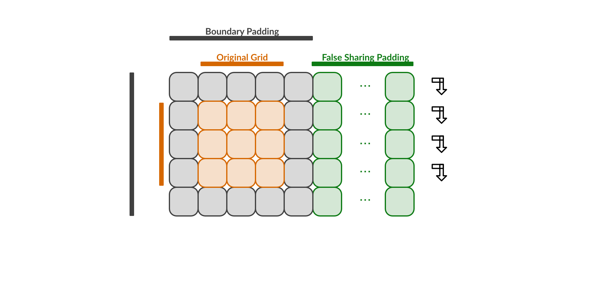
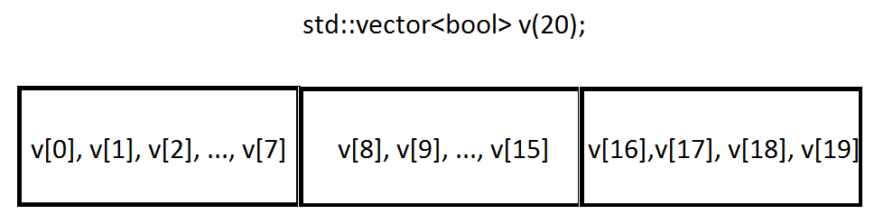
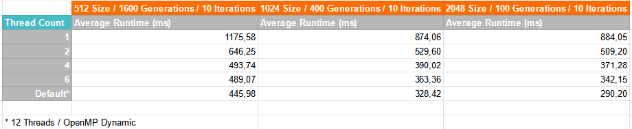
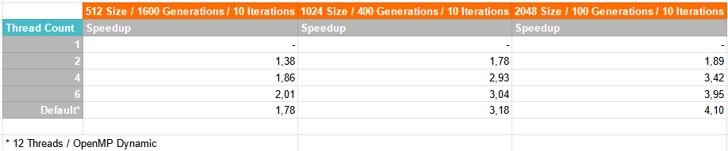
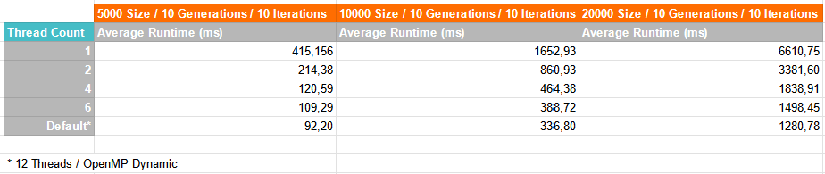
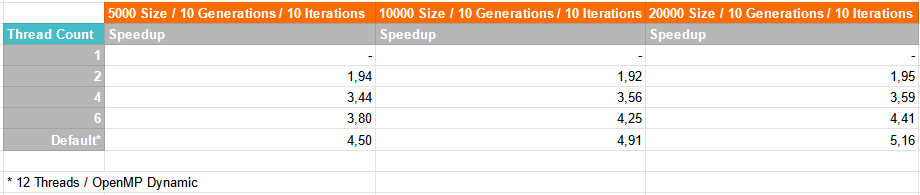

<div align="center">
  <p>Balint Taschner | Kacper Urbaniec | PPR | 06.04.2023</p>
  <h1><ins>Game of Life</ins></h1>
</div>

## Problem domain

From [Wikipedia](https://en.wikipedia.org/wiki/Conway%27s_Game_of_Life):

*The Game of Life, also known simply as Life, is a cellular automaton devised by the British mathematician John Horton Conway in 1970. It is a zero-player game, meaning that its evolution is determined by its initial state, requiring no further input. One interacts with the Game of Life by creating an initial configuration and observing how it evolves. It is Turing complete and can simulate a universal constructor or any other Turing machine.* 

*The universe of the Game of Life is an infinite, two-dimensional orthogonal grid of square cells, each of which is in one of two possible states, live or dead (or populated and unpopulated, respectively). Every cell interacts with its eight neighbours, which are the cells that are horizontally, vertically, or diagonally adjacent. At each step in time, the following transitions occur:*

1. Any live cell with fewer than two live neighbours dies, as if by underpopulation.
2. Any live cell with two or three live neighbours lives on to the next generation.
3. Any live cell with more than three live neighbours dies, as if by overpopulation.
4. Any dead cell with exactly three live neighbours becomes a live cell, as if by reproduction.

*These rules, which compare the behaviour of the automaton to real life, can be condensed into the following:*

1. Any live cell with two or three live neighbours survives.
2. Any dead cell with three live neighbours becomes a live cell.
3. All other live cells die in the next generation. Similarly, all other dead cells stay dead.

## Approach

The parallelization approach is based on the explanations of section *Loop-based parallelism* from *Victor Eijkhout, Topics in Parallel and Distributed Computing, Chapter 10
Parallel Programming Illustrated Through Conway’s
Game of Life*. It is probably the most primitive approach and strongly resembles the sequential implementation. Since each iteration and evaluation within a generation can be updated independently, they can be executed in any order, or in fact simultaneously.  

The author proposes following pseudocode for the implementation:

```python
def life_generation( board,tmp ):
    # OMP parallel for
    for i in [0:N-1]:
    	for j in [0:N-1]:
    		tmp[i,j] = board[i,j]
	# OMP parallel for
	for i in [0:N-1]:
		for j in [0:N-1]:
			board[i,j] = life_evaluation( tmp[i-1:i+1,j-1:j+1] 
```

Our final solution bears strong resemblances, performing the parallelization also on rows via OpenMP, however instead of copying the board grid & temporary one, the pointers are just swapped. 

```c++
void nextGeneration(int size, CellA* oldGrid, CellA* newGrid) {
    #pragma omp parallel for collapse(1) \
    schedule(static) \
    default(none) firstprivate(size, oldGrid, newGrid)
    for (auto i = 0; i < size; ++i) {
        auto startIndex = GameOfLife::rowStartIndexAt(i, size);
        for (auto j = 0; j < size; ++j) {
            auto pos = startIndex + j;
            auto aliveNeighbours = neighbourCount(pos, size, oldGrid);
            toBeOrNotToBe(pos, aliveNeighbours, oldGrid, newGrid);
        }
    }
}
...
for (auto g = 0; g < generations; ++g) {
    nextGeneration(size, oldGrid, newGrid);
    std::swap(oldGrid, newGrid);
}
...
```

The downsides of the implementation & the general problem with the game of life is, that this parallelism is only possible within a generation as the neighbour counting can reference rows that are worked on by other threads. This is why a temporary grid for reading and a new grid for writing is used; the temporary grid is the snapshot of the last generation and basis for evaluation. This means after each generations the worker threads must be synchronized which can result in an overhead. The workers should finish each generation in a comparable time in theory, however nothing prevents the operation system to schedule something outside the application context, slowing one or more worker threads, delaying the synchronization and start of a new generation.

### Grid & Boundary Checks

Conway designed the game for an infinite grid. However, memory is finite so a strategy must be made. Our implementation uses the most basic solution, the provided grid cannot be resized and every cell outside the grid is assumed dead. 

To avoid border checking and improve performance the grid is padded around with dead cells. So an input grid of 3x3 becomes internally 5x5, but iterations are only performed on the original 3x3 indices. To be precise, our implementation uses an one-dimensional array that is logically handled like a two-dimensional array which streamlines memory allocation/deallocation. Also, later implementations also introduced a padding for each logical row to be absolutely sure that writing operations on neighbouring rows evaluated by different worker threads do not invalidate cache lines. So the final representation of the grid can be visualized as the following:



### Troubles with class template specification `std::vector<bool>`

The first attempt at the game of life problem definition used internally `std::vector<bool>` to process the grid. The vector was shared by multiple workers via reference and could be written simultaneous. In theory, this should be no problem as no thread writes to the same index as another one, however the parallel results often contained erroneous cell values. 

In order to investigate the problem, the idea was to analyse the underlying array via [`std::vector's data`](https://en.cppreference.com/w/cpp/container/vector/data) method. Surprisingly, there was no implementation for it, because the [vector of bool is a specialized version of vector](https://cplusplus.com/reference/vector/vector-bool/). This lead to the following [stackoverflow post](https://stackoverflow.com/a/46115714), which explains it quite well:

>  *[`std::vector`](http://www.cplusplus.com/reference/vector/vector-bool/) stores multiple values in 1 byte. Think about it like a compressed storage system, where every boolean  value needs 1 bit. So, instead of having one element per memory block  (one element per array cell), the memory layout may look like this:*
>
> 

This means that when two worker threads access for example indices 8 & 15 and write at the same time one write attempt would be lost. 

The fix was to use `std::vector<unsigned char>` to get an array where each value occupies 1 byte. This lead to correct results of parallel executions. 

## Improvements

The following benchmarks were presented at the [interim presentation](https://docs.google.com/presentation/d/1Dz9J-74cFxwajnAQ61yJIGTDnNab2eYyysM42fTp0qE/edit?usp=sharing). The average runtime is tolerable but the achieved speedup is quite low and worse than expected. 

> Benchmarks were performed on a mobile Intel i7-8750H CPU (6 Total Cores / 12 Total Threads). All runs besides the default one [set the thread count manually and disable OpenMP dynamic to limit used threads](https://stackoverflow.com/a/11096742).




As mentioned earlier, parallel execution is only applicable within a generation, after that workers must wait for each other before starting evaluating a new generation. So grid size is the main parameter for parallelization, as rows are divided evenly between workers when evaluation cells, and not the number of generations. This trend can be observed in the benchmarks; higher grid size results in higher speedup. However a speedup of factor 3 on a 6 core CPU is still underwhelming. Therefore some improvements were made in the codebase & benchmark methodology. 

### Vector to Array

The consensus seems that there should be no performance penalty using a `std::vector` over a standard array. When no resize is happening (e.g. pushing new elements, which was not done in the code), there should be no observable difference.

After using `std::vector<unsigned char>` to omit the problems related the specialisation of `std::vector<bool>` other vector types were used like `std::vector<int>` to check if different memory alignments [(`unsigned char` takes 1 byte, `int` takes 4)](https://en.cppreference.com/w/cpp/language/types) affect performance but no effects were observed.

Strangely, which improved performance the most was to use a standard `bool` array. Instead of passing the grid vectors via shared references to openmp, with pointers one could use now private variables initialized via `firstprivate` to share the grid pointers of the arrays. In some best cases it could improve average runtime by about 20-30 % depending on the parameters. 

Why this change resulted in such improvements is quite speculative on our end. At the end of day, a vector is an abstraction over a standard array and each abstraction will add some overhead, even so slightly. Even a slightly increased time for index accesses/writes accumulates  when they are performed many times, as is the case in the game of life. Maybe the used `MinGW w64 9.0` toolchain optimizes standard arrays better than vectors in combination with openmp. But this are just assumptions that would require more research.

### No more Resetting

In the implementation at the time of the interim presentation the method that determined cell state and performed write operations, the `toBeOrNotToBe` method invoked in `nextGeneration`, only wrote alive cell values because the new grid was reset sequentially to a grid with only dead values after each generation. The idea was that a reset via `std::fill(newGrid.begin(), newGrid.end(), DEAD)` is quite fast, [as it can dump 16 bytes at a time](https://stackoverflow.com/a/8848612), and would speedup row evaluations as dead values would not be written anymore. 

However, this assumption was wrong, as when removing the reset code and writing both alive/dead cell values in `toBeOrNotToBe` performance average runtime was improved by about 5-10 % in best cases. One reason could be that worker threads that wrote less cells were finished more early that ones that wrote more but at the end one must wait for all workers. Thus this premature optimization with the grid reset could lead to work imbalance plus the additional sequential overhead of `std::fill` even when it is cheap. 

### False Sharing Padding

As mentioned in the *Grid & Boundary Checks* section, the one dimensional grid also contains padding for each logical row. On most machines 64 elements occupying 64 bytes  in total (determined by `std::hardware_destructive_interference_size`) are added per row so one can be certain that multiple worker threads do not write to the same cache line. 

Regarding performance, no real difference was observed with or without false sharing padding. However, machines with more cores and/or wider cache lines could profit more from this measure then the used machine with an mobile six core processor.

### Other Considerations

Following considerations were also made but were reverted as no benefit or even worse performance was observed.

#### Rearrange OpenMP

Quite a few [posts](https://stackoverflow.com/a/13846821) mention that is better to have a wider parallel region to avoid creation/destruction of working threads. So following code (simplified for clarity) was rearranged like follows:

```c++
for (auto g = 0; g < generations; ++g) {
    #pragma omp parallel for collapse(1) \
    schedule(static) \
    default(none) firstprivate(size, oldGrid, newGrid)
    for (auto i = 0; i < size; ++i) {
        // Cell calculations
    }  
    std::swap(oldGrid, newGrid);
}
```

```c++
#pragma omp parallel default(none) firstprivate(generations, size) shared(oldGrid, newGrid)
{
    for (auto g = 0; g < generations; ++g) {
    	#pragma omp for schedule(static)
        for (auto i = 0; i < size; ++i) {
        	// Cell calculations
        }
        // Swap only once and create synchronization barrier
        #pragma omp single
        {
            std::swap(oldGrid, newGrid);
        }
    }
}
```

The new approach is a bit more verbose and no real performance difference was observed, therefore the change was reverted. [Most compilers use by default a thread pool internally for openmp](https://stackoverflow.com/a/24756350) so the restructuring is not needed as threads are created once and then reused.

#### ALIVE/DEAD Constants

One bizarre optimisation measure was to change how constants are handled. Instead of writing `true` or `false` following constants were used:

```c++
// global.h
extern const bool ALIVE;
extern const bool DEAD;
// global.cpp
const bool ALIVE = true;
const bool DEAD = false;
```

There are implicitly shared in openmp and the considerations were made to use the define directive to substitute the values by the pre-processor. This optimization measure in itself was unnecessary as there was no real performance difference between the constants and using `true`/`false` by itself but was made nonetheless to be safe. 

```c++
#define ALIVE true
#define DEAD false
```

However, what was more baffling is, that the new approach crippled performance really bad. Doubling runtime & worse. Maybe the combination of openmp compiler directives with defined values resulted in unoptimizable code but that is pure speculation. This change was quickly reverted and not investigated further.

## Benchmarks

With the new improved implementation in place the initial benchmark settings were run again. Results seemed promising; the average runtimes seemed to improve quite a bit however the speedups were still quite lower than the theoretical maximum, a factor of six on a six core processor. Observing the benchmark runs with task manager open helped identifying a hardware feature that kind of invalidated the benchmark results.

### Turbo Boost

Most modern CPUs feature frequency boost technologies like [Intel's Turbo Boost Technology](https://www.intel.com/content/www/us/en/gaming/resources/turbo-boost.html):

*When handling light workloads, the CPU runs at the base frequency listed in its specifications. (Or lower, when the energy-saving Intel  SpeedStep® technology scales CPU speeds.) When handling hardware threads marked for high performance, Intel® Turbo Boost Technology increases  the clock speed up to the Max Turbo Frequency.*

Very important is this statement, especially considering the benchmarks were performed on a mobile CPU with limited thermal headroom & power limit:

*Note that depending on its situation, a given CPU may not always reach  its Max Turbo Frequency. The dynamic increase in speed changes depending on the workload and the thermal headroom available.*

The used [i7-8750H CPU has a base frequency of 2.20 GHz but a max turbo boost of 4.10 GHz](https://www.intel.com/content/www/us/en/products/sku/134906/intel-core-i78750h-processor-9m-cache-up-to-4-10-ghz/specifications.html). When running the benchmarks one could see in real-time that clock speeds were rapidly dropping the more threads were used. Benchmark runs with one configured thread run at about 3.8 GHz were as runs with 6 or more configured threads were just above the base frequency. Such stark differences would probably not be observed on desktop chips or mobile processors with a lower TPD. So in order to provide a more fair testing environment the turbo boost feature was disabled in the BIOS so that all benchmarks would run at 2.20 GHz.

With turbo boost disabled the new benchmark results show more clearly the trend that a higher grid size can result in higher speedups as it is the main parallelization aspect. One can also see that for smaller grid sizes the parallelization overhead is much more noticeable than for higher ones but still a speedup is achieved, even when only by little. 




### Bigger Test Data

One aspect when benchmarking is that test data is big enough. With a grid of 2048x2048 a speedup of 4.10 was achieved. What if one goes beyond this size even further? 

The following benchmarks show runs with quite large grids. They continue the trend of the previous benchmarks and one can observe even better speedups, gradually approaching the theoretical maximum.





### Raw Data

Raw data to benchmark runs can be found in [`RAWDATA.md`](./RAWDATA.md).

## Sources

* https://en.wikipedia.org/wiki/Conway%27s_Game_of_Life
* Victor Eijkhout, Topics in Parallel and Distributed Computing, Chapter 10
  Parallel Programming Illustrated Through Conway’s
  Game of Life
* https://cplusplus.com/reference/vector/vector-bool/
* https://stackoverflow.com/a/46115714
* https://www.intel.com/content/www/us/en/gaming/resources/turbo-boost.html
